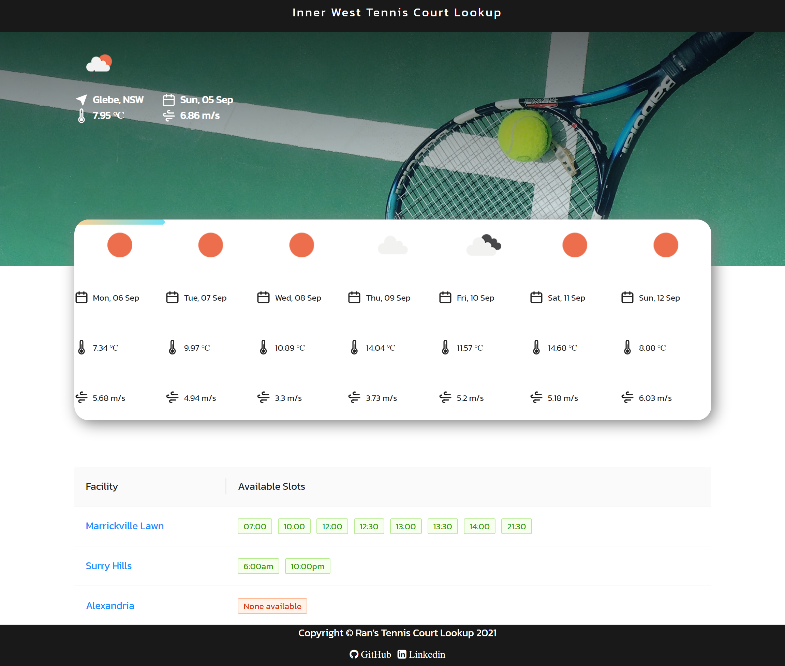

# Tennis Court Lookup :triangular_flag_on_post: Inner West Sydney

## 

### Table of Contents

You're sections headers will be used to reference location of destination.

- [Description](#description)
- [License](#license)
- [Author Info](#author-info)

---

## Description

How do you normally make a booking for tennis court?

1. :smile: Open the booking website of your favourite tennis court
2. No luck :unamused: open the next best option
3. No luck :disappointed: repeat step 2
4. Finally a spot available! BUT BAD WEATHER :scream: os: "I've just wasted 10mins!"

Inner West Tennis Court Lookup searches for the available time slots from the four of my favourite tennis courts, presents the weather forecast for the next 7 days and provides redirection links to those websites all at one place.

It can be accessed at the link below.

> https://tennis-timetable.web.app

#### Technologies

- Frontend: React.js, JavaScript, HTML & CSS
- Backend: Node.js
- Cloud: Firebase function & deploy
- Web scraping: Puppeteer

---

## License

MIT License

---

## Get in touch

  <a href="https://www.instagram.com/ranwren/">
    
@ranwren

    
  </a>
<a href="https://www.linkedin.com/in/ding-ran/">
  
@Ran Ding

    
  </a>

[Back To The Top](#)
